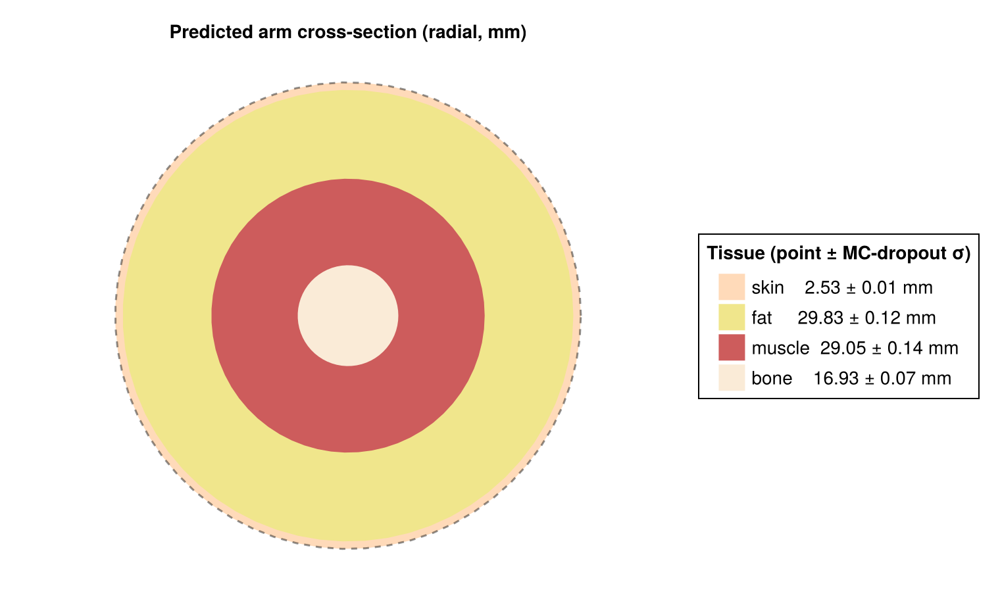
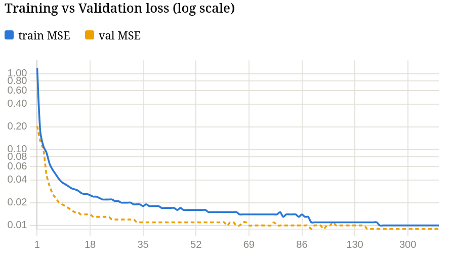
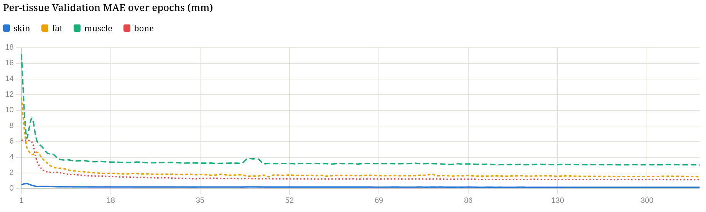
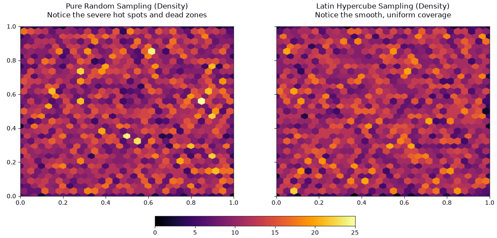
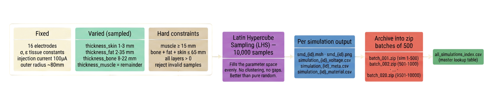

# Non-Invasive Tissue Layer Estimation

Deep learning model for estimating tissue layer thicknesses from Electrical Impedance Tomography (EIT). NO imaging, NO radiation, NO contact beyond surface electrodes.



---

## What is this?

EIT works by injecting a small current (100 µA) through electrodes placed on the skin and measuring the resulting boundary voltages. Because different tissues (skin, fat, muscle, bone) have distinct electrical conductivities, the voltage pattern encodes information about the internal geometry.

This project takes a different approach: train a neural network to directly map the 416-dimensional voltage measurement vector to the 4 tissue thicknesses in one forward pass.

**Result:** mean R² of 0.888 across all four tissues, sub-millimeter precision on skin (MAE 0.17 mm).

---

## Model

A 5-layer MLP trained in [Lux.jl](https://github.com/LuxDL/Lux.jl):

```
416 → 512 (BN + ReLU + Dropout) → 256 (BN + ReLU + Dropout) → 128 (BN + ReLU) → 64 (ReLU) → 4
```

- **Input:** 416 complex voltage measurements (real + imaginary concatenated)
- **Output:** [skin, fat, muscle, bone] thickness in mm
- **Uncertainty:** Monte Carlo Dropout (200 stochastic passes at inference)

---

## Results

| Tissue | MAE (mm) | RMSE (mm) | R² |
|--------|----------|-----------|-----|
| Skin | 0.169 | 0.217 | 0.865 |
| Fat | 1.495 | 1.961 | 0.956 |
| Muscle | 3.013 | 3.804 | 0.860 |
| Bone | 1.136 | 1.417 | 0.873 |
| **Mean** | | | **0.888** |

### Training convergence





---

## Dataset

10,000 FEM simulations of a 4-layer concentric arm cross-section (bone, muscle, fat, skin) with 16 surface electrodes. Layer thicknesses were sampled using **Latin Hypercube Sampling** to ensure uniform coverage of the anatomical parameter space.



### Anatomical ranges

| Layer | Range |
|-------|-------|
| Skin | 1–3 mm |
| Fat | 2–35 mm |
| Bone radius | 8–22 mm |
| Muscle | remainder (≥ 15 mm) |
| Total outer radius | 60–95 mm |

### Pipeline



10 example simulations are included in `sample_data/` for testing the inference tool without generating the full dataset.

> **Note:** `generate_arm_dataset.jl` depends on a JuliaFEM installation with a custom EIT simulation environment (`generateSkinmodel`, `buildMatrix`, etc.) and is not independently runnable. It is included for reference and transparency.

---

## Inference

Run either trained model on any voltage CSV:

```bash
# Complex voltage model (better accuracy)
julia --project=. eit_predict.jl sample_data/sim1/simulation_1_voltage.csv \
  --checkpoint checkpoints/complex/best_model.jld2 \
  --dims 416 --samples 200 --out result.png

# Real-only model
julia --project=. eit_predict.jl sample_data/sim1/simulation_1_voltage.csv \
  --checkpoint checkpoints/real_only/best_model.jld2 \
  --dims 208 --samples 200 --out result.png
```

**Output:** terminal prediction + uncertainty values, and a PNG cross-section diagram.

`--samples` controls MC-Dropout passes. 50 is faster, 200 is more stable. Default is 200.

> **Note:** Trained checkpoints are not included in this repo due to file size. Train your own using `eit_trainer_cpu_f.jl` with a full dataset.

---

## Training

```bash
julia --project=. eit_trainer_cpu_f.jl
```

Expects simulations at `simulations/arm/simulation_{id}_voltage.csv` and `simulation_{id}_meta.csv`.

Key hyperparameters (all in `eit_trainer_cpu_f.jl`):

| Parameter | Value |
|-----------|-------|
| Batch size | 512 |
| Max epochs | 500 (early stop patience 30) |
| Learning rate | 1e-3 → 1e-5 cosine decay |
| Optimiser | Adam |
| Dropout | 0.10 (wide layers only) |
| Loss | MSE (normalised space) |

---

## Setup

```julia
using Pkg
Pkg.add(["Lux", "Zygote", "Optimisers", "MLUtils",
         "CSV", "DataFrames", "JLD2", "CairoMakie",
         "Statistics", "Random"])
```

---

## Stack

- **Language:** Julia
- **ML framework:** Lux.jl
- **Autodiff:** Zygote.jl
- **FEM simulation:** JuliaFEM (dataset generation only)
- **Visualisation:** CairoMakie

---

## Notes

GPU training was attempted on an AMD Radeon RX 9060 XT via ROCm/AMDGPU.jl but encountered a confirmed bug in MLUtils.jl's DeviceIterator causing random crashes during shuffle indexing on ROCArray data. CPU training on a Ryzen 9 9600X was fully stable. GPU support will be re-enabled once the upstream bug is resolved.
